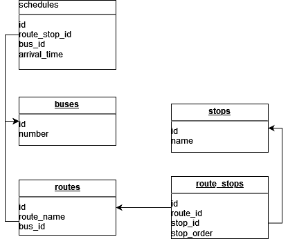

# Схема базы данных

# Инструкция по запуску проекта

Клонируйте репозиторий
Создайте бд и настройте нужные параметры в файле .env (Название бд указано в .env)
Установите зависимости: composer install
Заполните базу данных: php artisan migrate --seed
Запустите локальный сервер: php artisan serve

Тестирование можно выполнялось через Postman